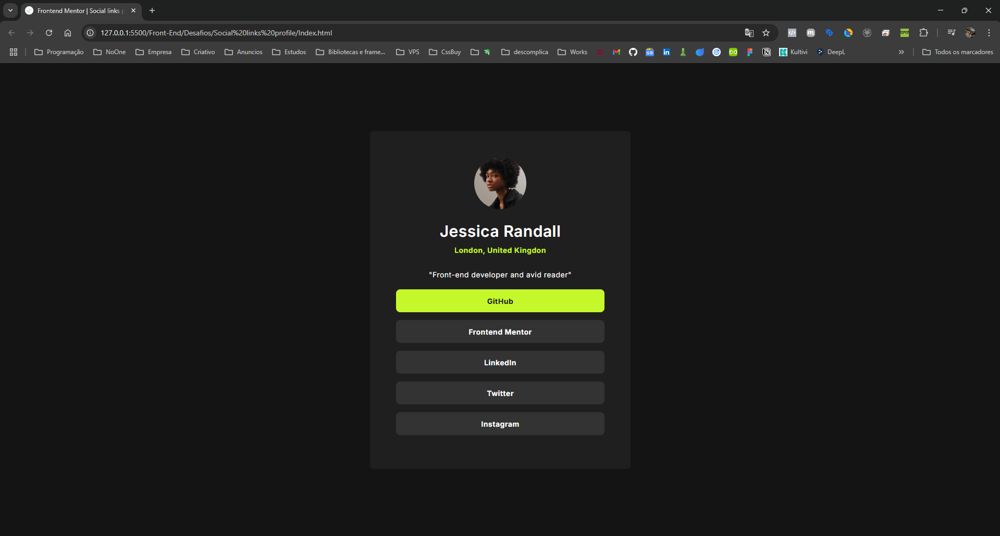

# Frontend Mentor - Social links profile solution

This is a solution to the [Social links profile challenge on Frontend Mentor](https://www.frontendmentor.io/challenges/social-links-profile-UG32l9m6dQ).

## Table of contents

- [Overview](#overview)
  - [About](#About)
  - [Screenshot](#screenshot)
  - [Links](#links)
- [Built with](#built-with)
- [Author](#author)

## Overview

### About
A simple project to practice HTML and CSS.

### Screenshot

### Links
- Live Site URL: ([Click Here](https://mmatheusproenca.github.io/Frontend-Mentor-Social-links-profile/Index.html))

## Built with

- Semantic HTML5 markup
- CSS custom properties
- Flexbox

## Author

- Frontend Mentor - [@MMatheusProenca]([https://www.frontendmentor.io/profile/yourusername](https://www.frontendmentor.io/profile/MMatheusProenca))
- Instagram - [@o_oprops]([https://www.twitter.com/yourusername](https://www.instagram.com/o_oprops/))

